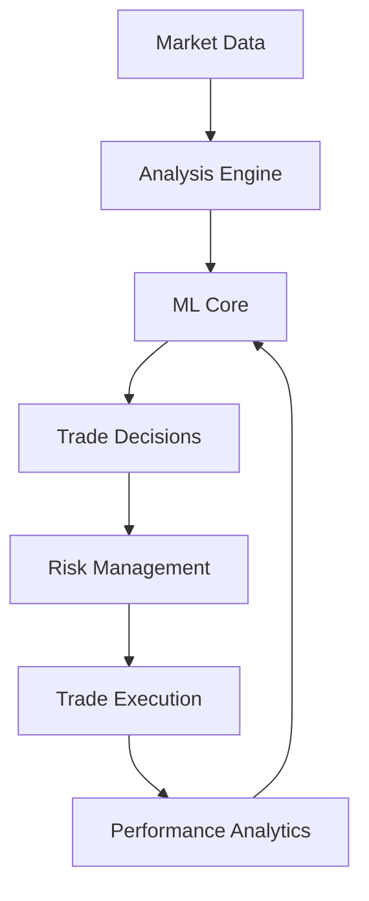

# Jarvis Trading Bot - System Manual

## Executive Summary

The Jarvis Trading Bot is a sophisticated automated trading system that leverages machine learning to execute trades on the foreign exchange market. This comprehensive manual provides detailed guidance for setup, operation, maintenance, and troubleshooting of the system.

### Core Features
- Machine Learning-driven Trade Analysis
- Real-time Market Data Processing
- Adaptive Learning System
- Risk Management Framework
- Performance Analytics
- Automated Trade Execution

### Key Components
- Flask Web Server (app.py)
- Trade Analysis Engine (trade_analyzer.py)
- Machine Learning Module (model_trainer.py)
- OANDA Integration (oanda_client.py)
- TradingView Connection (tradingview_client.py)

## Table of Contents
1. [System Overview](#1-system-overview)
2. [Installation Guide](#2-installation-guide)
3. [Configuration](#3-configuration)
4. [Operation Procedures](#4-operation-procedures)
5. [Monitoring and Analytics](#5-monitoring-and-analytics)
6. [Risk Management](#6-risk-management)
7. [System Maintenance](#7-system-maintenance)
8. [Performance Optimization](#8-performance-optimization)
9. [Legal Compliance and Taxation](#9-legal-compliance-and-taxation)
10. [System Scaling and Future Upgrades](#10-system-scaling-and-future-upgrades)
11. [Troubleshooting Guide](#11-troubleshooting-guide)
12. [Emergency Protocols](#12-emergency-protocols)
13. [Appendices](#13-appendices)

## 1. System Overview

### 1.1 Architecture Overview
The Jarvis Trading Bot employs a modular architecture designed for reliability, scalability, and maintainability:

#### Core Modules
1. **Web Server Module**
   - Handles API requests
   - Manages web interface
   - Processes webhooks
   - Coordinates system components

2. **Analysis Engine**
   - Processes market data
   - Evaluates trade opportunities
   - Generates trade signals
   - Monitors position performance

3. **Machine Learning Core**
   - Trains on historical data
   - Adapts to market conditions
   - Improves decision-making
   - Updates trading strategies

4. **Risk Management System**
   - Enforces position limits
   - Manages exposure
   - Implements stop-loss
   - Controls drawdown

### 1.2 Data Flow


### 1.3 System Requirements

#### Hardware Requirements
- CPU: 4+ cores recommended
- RAM: 8GB minimum, 16GB recommended
- Storage: 100GB SSD recommended
- Network: Stable internet connection required

#### Software Requirements
- Python 3.11 or higher
- OANDA API access
- TradingView Pro account
- Required Python packages (see requirements.txt)

## 2. Installation Guide

### 2.1 Environment Setup

**Step 1: Core Installation**
```bash
# Create and activate virtual environment
python -m venv venv
source venv/bin/activate  # Linux/Mac
venv\Scripts\activate     # Windows

# Install requirements
pip install -r requirements.txt
```

**Step 2: Create Required Directories**
```bash
mkdir data models logs
```

### 2.2 TA-Lib Installation

TA-Lib is a critical component for technical analysis. Installation varies by platform:

#### Windows Installation
1. Download ta-lib-0.4.0-msvc.zip
2. Extract to C:\ta-lib
3. Add to System Path
4. Install Python wrapper

#### Linux/Mac Installation
See Appendix A for detailed instructions.

### 2.3 Initial Configuration

Create `.env` file with required settings:
```ini
OANDA_API_KEY=your_api_key
OANDA_ACCOUNT_ID=your_account_id
OANDA_LIVE=false
OANDA_API_URL=https://api-fxpractice.oanda.com
```

## 3. Configuration

### 3.1 Mode Selection

The system operates in two modes:

#### Practice Mode
- Uses OANDA practice API
- No real money at risk
- Ideal for testing and development
- Unlimited virtual funds

#### Live Trading Mode
- Connects to live markets
- Requires additional verification
- Uses real funds
- Enhanced security measures

### 3.2 Risk Parameters

Configure risk management settings in `config.py`:

| Parameter | Description | Default | Range |
|-----------|-------------|---------|--------|
| max_position_size | Maximum position size | 100,000 | 1,000-1,000,000 |
| max_daily_trades | Maximum daily trades | 20 | 1-100 |
| max_drawdown | Maximum drawdown % | 2.0 | 0.1-10.0 |
| risk_per_trade | Risk per trade % | 1.0 | 0.1-5.0 |

## 4. Operation Procedures

### 4.1 System Startup

Follow this sequence to start the system:

1. **Environment Activation**
   ```bash
   source venv/bin/activate  # Linux/Mac
   venv\Scripts\activate     # Windows
   ```

2. **System Check**
   - Verify disk space
   - Check data directory
   - Confirm model files exist

3. **Connection Test**
   ```bash
   python test_connection.py
   ```

4. **Start Trading System**
   ```bash
   python app.py
   ```

### 4.2 Trading Hours

The system operates during major forex market hours:

| Session | Hours (UTC) | Activity |
|---------|-------------|----------|
| Asian | 23:00-08:00 | Moderate |
| European | 07:00-16:00 | High |
| American | 12:00-21:00 | High |

### 4.3 Daily Operations

1. **Pre-Market Tasks**
   - Check system status
   - Verify account balance
   - Review overnight positions
   - Check economic calendar

2. **During Market Hours**
   - Monitor trade execution
   - Check system performance
   - Review risk metrics
   - Monitor news events

3. **Post-Market Tasks**
   - Review daily performance
   - Backup trade data
   - Check for system updates
   - Generate reports

## 5. Monitoring and Analytics

### 5.1 Performance Metrics

Monitor these key metrics daily:

1. **Trade Performance**
   - Win rate
   - Profit factor
   - Average profit per trade
   - Maximum drawdown

2. **System Health**
   - CPU usage
   - Memory utilization
   - Network latency
   - API response times

### 5.2 Analytics Tools

1. **Performance Dashboard**
   Access at: `http://localhost:5000/dashboard`
   - Real-time metrics
   - Performance charts
   - Risk analytics
   - Trade history

2. **Report Generation**
   ```bash
   python generate_reports.py
   ```
   Generates comprehensive reports in `reports/` directory

### 5.3 Learning System Analytics

Track the learning system's progress:

1. Monitor `data/performance_history.csv`:
   - Win rate progression
   - Profit factor trends
   - Learning factor impact
   - Strategy adaptation

2. Review feature importance:
   ```python
   model_trainer.feature_importance
   ```

## 6. Risk Management

### 6.1 Position Management

The system employs multiple risk control mechanisms:

1. **Position Sizing**
   - Based on account equity
   - Adjusted for volatility
   - Considers market conditions
   - Respects maximum limits

2. **Stop Loss Management**
   - Dynamic stop loss calculation
   - Trail stops on profitable trades
   - Emergency stop loss system
   - Multi-level protection

3. **Exposure Control**
   - Maximum open positions
   - Correlation monitoring
   - Currency pair limits
   - Total exposure caps

### 6.2 Risk Monitoring

Monitor these risk metrics continuously:

| Metric | Warning Level | Critical Level |
|--------|---------------|----------------|
| Drawdown | 1.5% | 2.0% |
| Exposure | 80% | 95% |
| Loss Streak | 5 trades | 8 trades |
| Profit Factor | 1.2 | 1.0 |

## 7. System Maintenance

### 7.1 Regular Maintenance

#### Daily Tasks
- Check system logs
- Review performance metrics
- Backup critical data
- Verify connections

#### Weekly Tasks
- Analyze performance data
- Update risk parameters
- Clean up old logs
- Check system resources

#### Monthly Tasks
- Full system backup
- Performance review
- Strategy optimization
- Model retraining

### 7.2 Data Management

1. **Backup Procedures**
   ```bash
   python backup_data.py
   ```
   - Backs up:
     - Trade history
     - Model files
     - Configuration
     - Performance data

2. **Data Cleanup**
   - Archive old logs
   - Compress trade history
   - Remove temporary files
   - Optimize databases

## 8. Performance Optimization

### 8.1 Model Training

Optimize model performance through:

1. **Data Collection**
   - Market conditions
   - Trade outcomes
   - Technical indicators
   - Price action

2. **Feature Engineering**
   - Technical indicators
   - Market patterns
   - Time-based features
   - Volatility metrics

3. **Model Updates**
   ```bash
   python adaptive_test_8000.py
   ```
   Tests model adaptation and learning

### 8.2 Strategy Optimization

1. **Parameter Tuning**
   - Risk levels
   - Entry/exit rules
   - Indicator settings
   - Time filters

2. **Performance Testing**
   ```bash
   python test_strategies.py
   ```
   Evaluates strategy effectiveness

## 9. Legal Compliance and Taxation

### 9.1 Regulatory Requirements

#### CFTC and SEC Compliance
1. **Registration Requirements**
   - Register as Commodity Trading Advisor (CTA) with CFTC
   - File Form 7-R for company registration
   - File Form 8-R for principals and associated persons
   - Maintain required regulatory capital
   - Submit periodic reports and disclosures

2. **NFA Membership**
   - Complete National Futures Association membership
   - Pay annual dues and fees
   - Comply with NFA rules and regulations
   - Complete required periodic training

3. **Disclosure Documents**
   - Prepare and maintain current Disclosure Document
   - Submit for NFA review
   - Provide to clients before account opening
   - Update annually or as material changes occur

#### SEC Requirements
1. **Investment Adviser Registration**
   - Register with SEC if AUM exceeds $110 million
   - File and maintain Form ADV
   - Implement compliance policies
   - Appoint Chief Compliance Officer

2. **State Registration**
   - Register in states where clients reside
   - Comply with state-specific requirements
   - Maintain state registrations
   - Pay state filing fees

### 9.2 Tax Compliance

#### Trading Activity Reporting
1. **Trade Documentation**
   - Record all trades with timestamps
   - Maintain audit trail
   - Document trading strategies
   - Keep records for 7 years

2. **Tax Forms Required**
   | Form | Purpose | Due Date |
   |------|----------|----------|
   | Schedule D | Capital gains/losses | April 15 |
   | Form 8949 | Trading transactions | April 15 |
   | Form 4797 | Section 1256 contracts | April 15 |
   | Form 1099-B | Broker transactions | February 15 |

#### Business Structure and Taxation
1. **Entity Selection**
   - LLC/Corporation registration
   - EIN application
   - State business registration
   - Local licenses and permits

2. **Tax Elections**
   - Section 475(f) trader status
   - Mark-to-market accounting
   - Quarterly estimated taxes
   - State tax registration

### 9.3 Documentation Requirements

#### Record Keeping
1. **Trading Records**
   - Complete trade history
   - Risk management logs
   - System modifications
   - Client communications

2. **Financial Records**
   - Daily account statements
   - Monthly reconciliations
   - Annual financial statements
   - Audit trail documentation

3. **Compliance Records**
   - Customer identification
   - Due diligence records
   - Training documentation
   - Incident reports

### 9.4 Client Documentation

#### Required Forms
1. **Account Opening**
   - Risk disclosure statements
   - Trading authorization
   - Power of attorney
   - Client questionnaire

2. **Periodic Reporting**
   - Monthly performance reports
   - Quarterly account statements
   - Annual tax documents
   - Risk assessment updates

## 10. System Scaling and Future Upgrades

### 10.1 Infrastructure Scaling

#### Hardware Scaling
1. **Compute Resources**
   | Trade Volume | CPU Cores | RAM | Storage |
   |-------------|-----------|-----|----------|
   | < 100/day | 4 cores | 16GB | 100GB SSD |
   | 100-500/day | 8 cores | 32GB | 500GB SSD |
   | 500+/day | 16+ cores | 64GB+ | 1TB+ SSD |

2. **Network Requirements**
   | Level | Bandwidth | Latency | Redundancy |
   |-------|-----------|---------|------------|
   | Basic | 100Mbps | <50ms | Single ISP |
   | Advanced | 1Gbps | <20ms | Dual ISP |
   | Enterprise | 10Gbps | <5ms | Multi-region |

#### Database Scaling
1. **Storage Optimization**
   - Implement data partitioning
   - Set up data archiving
   - Optimize query performance
   - Implement caching layers

2. **High Availability**
   - Master-slave replication
   - Automatic failover
   - Cross-region backup
   - Real-time synchronization

### 10.2 Performance Upgrades

#### Processing Optimization
1. **Algorithm Improvements**
   - Parallel processing
   - GPU acceleration
   - Optimized libraries
   - Custom C++ modules

2. **Data Pipeline Enhancement**
   - Real-time processing
   - Stream processing
   - Data compression
   - Efficient storage formats

### 10.3 Capacity Planning

#### System Growth Stages
1. **Stage 1: Basic (< $1M AUM)**
   - Single server deployment
   - Basic monitoring
   - Manual backups
   - Daily reconciliation

2. **Stage 2: Intermediate ($1M-$10M AUM)**
   - Load-balanced servers
   - Automated monitoring
   - Continuous backup
   - Real-time reconciliation

3. **Stage 3: Advanced ($10M+ AUM)**
   - Multi-region deployment
   - 24/7 monitoring
   - Enterprise backup
   - Institutional-grade infrastructure

#### Infrastructure Requirements

| Component | Stage 1 | Stage 2 | Stage 3 |
|-----------|---------|---------|---------|
| Servers | 1-2 | 3-5 | 10+ |
| Database | Single | Replicated | Distributed |
| Monitoring | Basic | Advanced | Enterprise |
| Support | Email | 12/5 | 24/7 |

### 10.4 Future Enhancements

#### Technical Improvements
1. **Machine Learning**
   - Deep learning models
   - Neural networks
   - Reinforcement learning
   - Advanced feature engineering

2. **Market Coverage**
   - Multiple asset classes
   - Cross-market analysis
   - Global market access
   - Custom instruments

3. **Risk Management**
   - Real-time risk analysis
   - Advanced portfolio optimization
   - Stress testing
   - Scenario analysis

#### System Integration
1. **External Systems**
   - Prime broker integration
   - Market data providers
   - News feeds
   - Social sentiment analysis

2. **Client Services**
   - Web portal
   - Mobile app
   - API access
   - Custom reporting

## 11. Troubleshooting Guide

### 11.1 Common Issues

#### Connection Problems
1. Check API credentials
2. Verify network connection
3. Test API endpoints
4. Review error logs

#### Performance Issues
1. Monitor system resources
2. Check database performance
3. Optimize queries
4. Review trade execution times

### 9.2 Error Recovery

When errors occur:

1. **Stop Trading**
   ```bash
   python emergency_stop.py
   ```

2. **Backup System State**
   ```bash
   python backup_system.py
   ```

3. **Review Logs**
   - Check error messages
   - Analyze system state
   - Review recent changes
   - Document findings

## 12. Emergency Protocols

### 10.1 Emergency Shutdown

In case of critical issues:

1. **Stop Trading**
   ```bash
   curl http://localhost:5000/emergency_stop
   ```

2. **Close Positions**
   ```bash
   python close_all_positions.py
   ```

3. **Save State**
   ```bash
   python save_state.py
   ```

### 10.2 Recovery Procedures

After emergency shutdown:

1. Verify data integrity
2. Check account status
3. Review error logs
4. Test system components
5. Gradual restart with reduced risk

## 13. Appendices

### Appendix A: Installation Details

#### TA-Lib Installation

**Linux:**
```bash
wget http://prdownloads.sourceforge.net/ta-lib/ta-lib-0.4.0-src.tar.gz
tar -xvf ta-lib-0.4.0-src.tar.gz
cd ta-lib/
./configure --prefix=/usr
make
sudo make install
```

**macOS:**
```bash
brew install ta-lib
```

### Appendix B: Configuration Templates

See `config_templates/` directory for example configurations.

### Appendix C: Contact Information

- System Administrator: [Contact]
- OANDA Support: [Contact]
- Emergency Support: [Contact]

---

Last Updated: July 20, 2025
Version: 2.0.0
